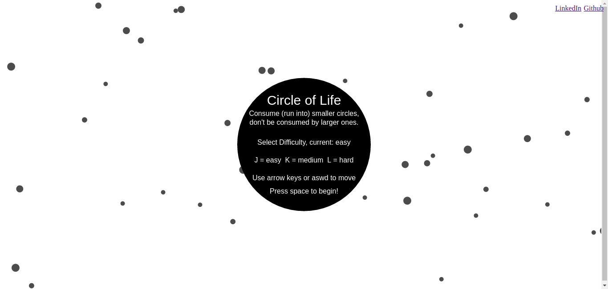

# Circle Of Life

## Background
Circle Of Life is a game very similar to agar.io. In this game a board is generated with many circles of random sizes. The goal of the user is to run into the circles smaller than they currently are and when contact is made they will consume that circle and grow in size. If the player makes contact with a circle larger than itself they lose and the game is over. In addition the user must shoot out some of its mass in order to change direction. The end goal of the game is to consume all the circles on the board and be the last left on the board.

## MVP
- [x] Start, pause, and be able to play again after winning/losing
- [x] Use the arrows or aswd keys to control their player
- [x] Choose difficulty (initial amount/size of enemy circles)
- [x] Initial overlay with direction/controls
- [x] Game over/winning screen with play again options
- [x] Production README

## Implementation
Circle of life was created using only vanilla JavaScript, and html5 canvas. The game was split into several classes including the following: `GameView`, `Game`, `Circle`, `Player`. Each of these classes were responsible for handling certain aspects of the entire game.



#### GameView
`GameView` was a class used to create a reference to the `canvas`, create a `context` from that `canvas`, and initialize the game when the DOM was loaded. It was also responsible for handling the timing of game updates and rendering using `window.requestAnimationFrame()`.

#### Game
The `Game` class handled all the game logic including: randomly generating enemy circles based on `difficulty`, telling all `Circle`s, and the `Player` to render and update, checking collisions between circles/player, checking if the game is over (`Player` has lost or won), and handling key events for the New Game/Lost/Won/Paused screens.

#### Circle
This class was used to represent each `Circle` in the `Game`, and held data for the `radius`, `position`, `color` and `momentum` of the `Circle`. (The `radius` was used as the mass of the `Circle` when calculating velocity from `momentum`, so that bigger circles will move slower and smaller ones can move more quickly.) This class also included methods for updating, rendering, growing, and shrinking the circles. Growing and shrinking were used when one circle consumed the other for useful user visualization. Here is how I implemented moving the `Circle` in the `update` method.

```js
update(dt) {
  // dt is the deltaTime represents deltaTime (now - lastRenderTime) and is used to produce the same movement at different frame rates.
  // momentum is a vector (array) with this structure [x, y]
  // this.r represents the radius of the circle.
  this.x += this.momentum[0] / this.r * dt;
  this.y += this.momentum[1] / this.r * dt;
}
```

#### Player
The `Player` class extended the `Circle` class because it used many of the same functionality the circle did. The only things that were overridden from the `Circle` class were the `constructor` and `update` methods. In the `constructor` the player was set with a different color, and a static initial size. In the `update` method, and extra variable was passed in from the game holding keypress data. The `Player` class used this data to increase and decrease the momentum of the player in different directions based on the user keypress input.
